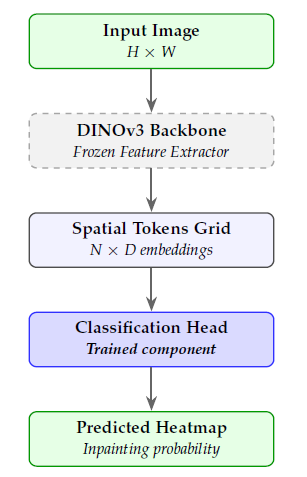
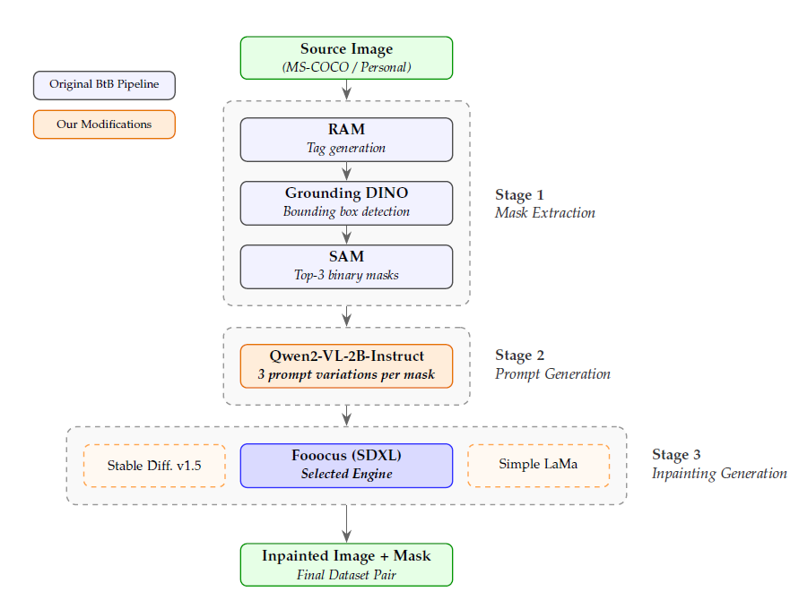
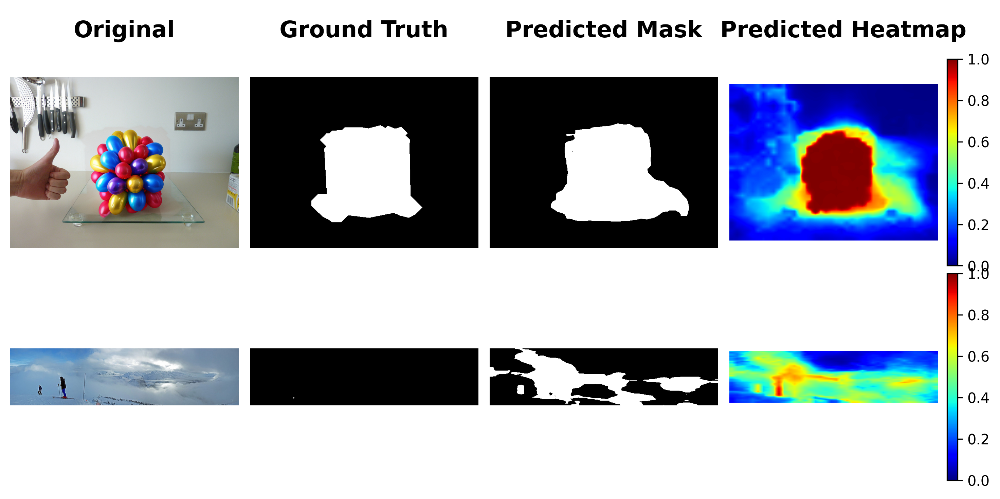
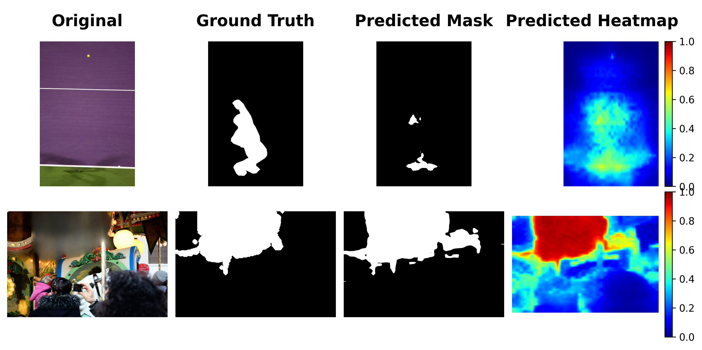
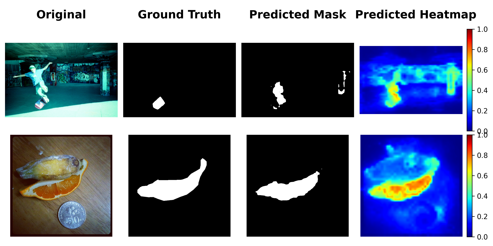
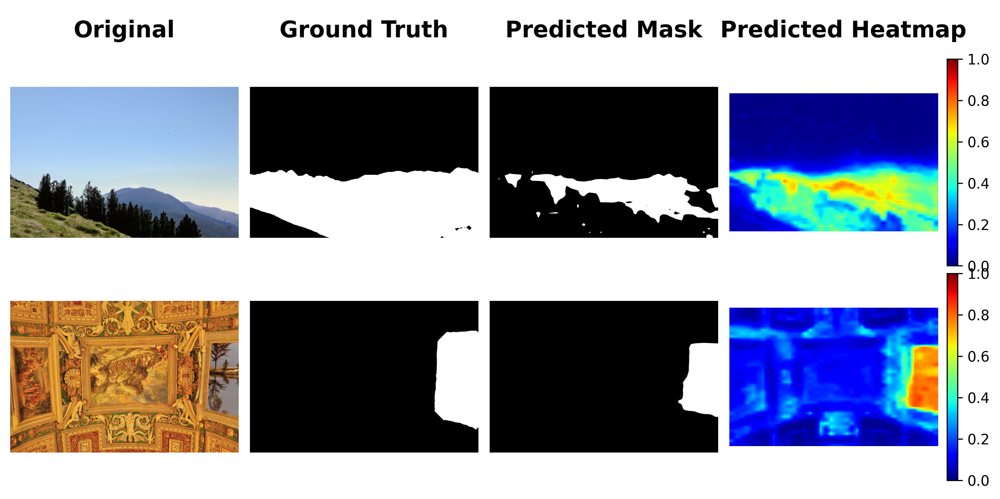

## Overview & Academic Context
This project is the implementation of my Bachelor's thesis for the Artificial Intelligence course at the **University of Pavia**, in collaboration with the company **IdentifAI Labs Spa**.    
For more details [Read the full Thesis (PDF)](BAI_Thesis_Diego_Meloni.pdf)

# Inpainting Detection and Localization via Vision Foundation Models

This repository contains an implementation of a lightweight and highly accessible methodology for generative inpainting localization. Traditional forensic models often require massive specialized architectures and prohibitive computational resources. This project demonstrates that a general-purpose Vision Foundation Model, specifically from the DINOv3 family, already encodes strong inpainting-relevant signals without requiring any task-specific fine-tuning.

By utilizing DINOv3 (ViT-S/16, ConvNeXt-Tiny, or ConvNeXt-Small) strictly as a frozen feature extractor, the localization task is reduced to training a minimal classification head (Linear, MLP, or CNN). This approach allows the entire training and high-resolution inference pipeline to run efficiently on a single consumer-grade GPU (e.g., NVIDIA RTX 3050 8GB) utilizing mixed-precision arithmetic, maintaining a minimal memory footprint.

The repo also contains a modified version of the Beyond the Brush pipeline for automatic inpainting generation.

## 📁 Repository Structure

The framework is strictly divided into two independent pipelines, each with its own environment and documentation:

### `01_inpainting_generation/` (Automated Dataset Creation)
A significantly modified and optimized version of the *Beyond the Brush* pipeline designed to automatically generate high-quality inpainted images.
*   **Mask Extraction**: Utilizes RAM, Grounding DINO, and SAM to automatically isolate semantically meaningful regions.
*   **Prompt Generation**: Replaces the original heavy VLM with the highly efficient **Qwen2-VL-2B-Instruct**, guided by complex chain-of-thought prompts to ensure contextual coherence.
*   **Generative Engine**: Relies on **Fooocus (Stable Diffusion XL)** for state-of-the-art photorealistic blending.
*   *Setup & Usage:* [`0_inpainting_procedure.md`](01_inpainting_generation/0_inpainting_procedure.md) contains detailed explanation of each file, along with instructions on how to operate and reproduce the approach used for inpainting generation.

### `02_inpainting_detection/` (The Dino Framework)
The core forensic pipeline built to train lightweight classification heads on top of frozen foundation models.
*   **Training**: A file used for the training the classification heads for the task of inpainting localization.
*   **Testing**: Two files (`2_dino_test.py`, `2_dino_test_models.py`) necessary to test the models. The two files are equivalent, but the second is able to assess per-generator localization metrics for the models used to create the SAGI-D inpainted images, providing some additional information. The first file can be used on any dataset and gives overall results.
*   **Additional files**: Two additional files containing the models of the classification heads and some utility functions.
*   *Setup & Usage:* [`0_dino_procedure.md`](02_inpainting_detection/0_dino_procedure.md) contains detailed explanation of each file, along with instructions on how to operate and reproduce the approach used for inpainting detection.

### Additional folders and files
*   **`Meloni_BAI_Thesis`**: Contains the full academic thesis providing an in-depth analysis of the architectural choices, ablation studies on loss functions, and failure modes.
*   **dataset**: Scripts for downloading, managing and splitting the datasets, including the SAGI-D benchmark used for primary training and out-of-distribution collections like BtB-Flickr30k and our custom BtB-COCO.
*   **weights**: The folder in which all the required weights must be placed. Note that paths might require to be adjusted to find the weights correctly.
*   **requirements**: A folder containing the requirements for the different virtual environments used for the inpainting and for the detection procedures.
*   **presentation_images**: Contains the images used for this presentation.

## Architecture & Key Features

The detection framework systematically compares multiple architectural and algorithmic choices to find the optimal balance between performance and computational efficiency.

*   **Frozen Backbones**: Evaluates three distinct DINOv3 models: **ViT-S/16**, **ConvNeXt-Tiny**, and **ConvNeXt-Small**.
*   **Classification Heads**: Tests three lightweight probes to decode the backbone's spatial embeddings: **Linear**, **MLP** (2-layer with GELU), and **CNN** ((1 x 1) and (3 x 3) convolutions for local context).
*   **Dual Inference Modes**: 
    *   *Resize-Based*: Images are rescaled to a fixed square resolution (e.g., 640x640) allowing standard batched processing. This method provides the network with global semantic context and is extremely fast, requiring only a single forward pass, but could disrupt the small inpainting traces by changing the original aspect ratio of the image and the spatial relation of pixels.
    *   *Patch-Based*: Images are kept at their native resolution. During inference, a fixed-size window (e.g., 512x512) slides across the image, and overlapping predictions are aggregated using Gaussian blending. The training is performed using patches of the original image at the same fixed dimension. This strategy preserves microscopic manipulation artifacts without introducing downsampling distortions, at the cost of a higher computational resource and time need for both training and inference.
*   **Robust Optimization**: Employs a joint **Dice Loss + Focal Loss** optimized via **Exponential Moving Average (EMA)** normalization to balance objective scales. Overfitting is heavily penalized through weight decay, dropout (p=0.3), and a strict spatial data augmentation pipeline (flips, rotations, color jitter, blur) applied to both images and masks at the same time only during the training process.

## Key Findings & Results

Several critical insights emerged after an extensive evaluation conducted on the SAGI-D dataset (which comprises manipulations obtained from five distinct state-of-the-art generative architectures: BrushNet, HDPainter, PowerPaint, InpaintAnything, and RemoveAnything):

1.  **Backbone & Head Synergy**: Vision Transformers structurally require non-linear heads (**MLP**) to decode their embeddings, whereas convolutional backbones (**ConvNeXt**) internally aggregate local context and achieve peak performance with simple **Linear** heads.
2.  **The Context Trade-off**: ViTs suffer significantly when deprived of global context, performing poorly in patch-based sliding window inference. Conversely, ConvNeXt backbones adapt better to isolated patches.
3.  **Generalization via Multi-Domain Training**: The model initially struggles to identify out-of-distribution manipulations generated by SDXL (Fooocus). However, training the network on a mixed-domain dataset (SAGI-D + Flickr30k) drastically recovers this gap, suggesting that although true generalization is not achieved for the task, frozen representations can simultaneously learn to identify manipulation traces coming from multiple distinct generative architectures.

### Optimal Configuration Performance
The absolute best results were achieved by the **DINOv3 ViT-S/16** paired with an **MLP head**, trained for 50 epochs using the **Resize-based (640x640)** inference mode. 

| Precision | Recall | F1 Score | IoU | Dice Score | AUROC |
| :---: | :---: | :---: | :---: | :---: | :---: |
| 0.8494 | 0.8587 | **0.8541** | **0.7453** | **0.8541** | **0.9701** |

*(Metrics computed globally on the test set of our selected portion of the SAGI-D dataset)*

## ⚖️ License & Acknowledgments

This project is licensed under the [MIT License](LICENSE).

This work builds upon concepts and resources from the open-source community:
*   The automated inpainting pipeline is inspired by [Beyond the Brush](https://github.com/IAPP-Group/Beyond-the-Brush).
*   Fooocus inpainting generator (based on Stable Diffusion XL) [Fooocus](https://github.com/lllyasviel/Fooocus).
*   Models were trained and evaluated using the [SAGI-D Dataset](https://www.kaggle.com/datasets/giakop/sagi-d) available on Kaggle.
*   Foundation models provided by [Meta AI (DINO)](https://github.com/facebookresearch/dinov3).